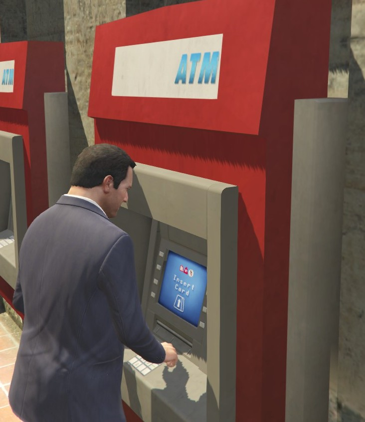

# AccountInBank-GTA5

This script lets you store ~~stolen~~ your money in bank account and earn interest (0.001% per day by default). Also you can transfer money between characters accounts.

Maximum balance: **2 147 483 647** for _each_ character.

[GTA5Mods](https://www.gta5-mods.com/scripts/accountinbank)

How to use
----------

 - Press **B** to mark the nearest ATM on the map;
 - Press **O** when you near ATM to open ATM menu.

Requirements 
--------------

- Microsoft [.NET Framework ≥ 4.8](https://dotnet.microsoft.com/download/dotnet-framework/net48);
- Microsoft [Visual C++ Redistributable for Visual Studio 2019 x64](https://support.microsoft.com/en-us/help/2977003/the-latest-supported-visual-c-downloads);
- [Script Hook V](http://gtaforums.com/topic/788343-script-hook-v/);
- [Community Script Hook V .NET ≥ v3.0.4](https://github.com/crosire/scripthookvdotnet/releases/tag/v3.0.4);
- [NativeUI Library](http://gtaforums.com/topic/809284-net-nativeui/).

How to install
--------------

Place the .dll and .ini files into your "**scripts**" folder, located in the main GTA V directory. If it doesn't exist, create it.

Known issues
--------------
Don't type numbers using your numpad. Sometimes it works incorrect.

Settings
--------------
**AccountInBankS.ini** file contains some mod settings:

Setting name | Valid values | Description
--- | --- | ---
MarkATMKey | [Look here](https://msdn.microsoft.com/en-us/library/system.windows.forms.keys(v=vs.110).aspx) | The key which marks the nearest ATM on the map
OpenATMMenuKey | [Look here](https://msdn.microsoft.com/en-us/library/system.windows.forms.keys(v=vs.110).aspx) | The key which opens ATM menu if you are near some ATM
LoseCashOnDeath | True / False | Lose all cash when you die
LoseCashOnArrest | True / False | Lose all cash when you get arrested
ShowAllATMLocations | True / False | Show all ATM locations on the map
EnableAnimation | True / False | Enable playback of animation
EnableDepositTax | True / False | Enable tax on new deposits
EnableWithdrawalTax | True / False | Enable tax on withdrawals
EnableServiceTax | True / False | Enable service tax (debited every day)
EnableMoneyTransferTax | True / False | Enable tax on the amount of transfer between the characters
DepositTax | Number or percent. E.g. 4500 or 3% | -
WithdrawalTax | Number or percent. E.g. 4732 or 5% | -
ServiceTax | Number or percent. E.g. 125 or 0.5% | -
MoneyTransferTax | Number or percent. E.g. 15021 or 2% | -

ATM location
--------------
If you found ATM that don't exist in the list - let me know.

Changelog
--------------
v2.0.2
- Fix bug with money transfer menu

v2.0.1
- Fix bug with flashing menu

v2.0.0
- Update .NET ScriptHook to the v3.

v1.1.7
- Update .NET ScriptHook and NativeUI to the latest versions.

v1.1.6
- Update .NET ScriptHook and NativeUI to the latest versions;
- Add new ATM location.

v1.1.5
- Update IniFile.dll to the latest version.

v1.1.4
- Fixed bug when available characters list doesn't get updated.

v1.1.3
- Fixed bug with ShowAllATMLocations feature;
- All dependencies are embedded in main dll.

v1.1.2
- Add animation (disabled by default).

v1.1.1
- Compatibility with .NET ScriptHook v2.0.

v1.1.0
- Use NativeUI Library for menu;
- Added new ATMs.

v1.0.9
- Added ability to disable playback of animation.

v1.0.8
- Added taxes feature: DepositTax, WithdrawalTax, ServiceTax and MoneyTransferTax.

v1.0.7
- Compatibility with .NET ScriptHook v1.0.

v1.0.6
- Bug fixes.

v1.0.5
- Added ability to change menu navigation keys (full list [here](https://msdn.microsoft.com/en-us/library/system.windows.forms.keys%28v=vs.110%29.aspx)).

v1.0.4
- Implemented ability to enter percents as value (just enter 50%, 37% etc; ALL also is supported);
- Added new atm location;
- Implemented option for show all atm icons on the map (can be activated in the AccountInBankS.ini file);
- Some fixes.

v1.0.3
- Default percent now 0.001%;
- Added animation playback.

v1.0.2
- Added features: LoseCashOnArrest and LoseCashOnDeath (disabled by default);
- Ability to transfer money between characters accounts;
- Bug fixes.

v1.0.1
- Ability to change default keys in .ini-file;
- Some fixes.
